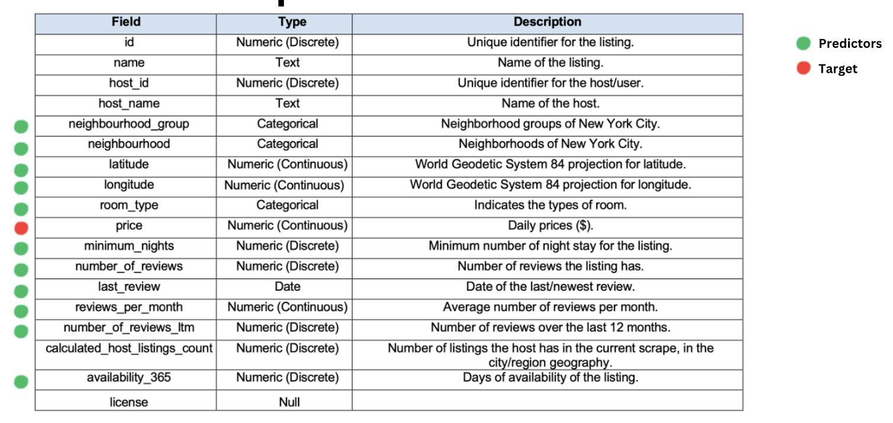

# 2025_ia651_kadel
# Airbnb Prices In New York City: Effects of Neighborhood and Customer Reviews on AirBnB Listing Prices

Bishruti Khakurel, Pragyan Kadel

06-07-2025

## About the Dataset

•	The dataset contains Airbnb records in the 5 Boroughs of New York City from 2011 to 2023. It is focused on the location of the Airbnbs, their amenities and the online reviews it has gotten over the timespan

•	It has 42,391 observations and 18 features

•	The dataset used in this study was obtained from Kaggle. It is a public dataset published by Airbnb, Inc.
The dataset was likely collected through Airbnb’s internal booking and user interaction systems and provides a foundation for analyzing how various factors influence listing prices.

This dataset is particularly valuable for:

•	Understanding how location and customer sentiment impact Airbnb pricing.

•	Developing pricing strategies for hosts and property managers.

•	Assisting new hosts in determining prices for their listings.

## Objective

To build a predictive model that can classify Airbnb prices into less than 500 dollars per night (Affordable) and greater than 500 dollars per night (Expensive).

## Data
 

## Description of variables
  

## Geographical Data Distribution
  

## Project Narrative

•	Began with exploratory data analysis to understand the dataset’s structure, missing values, and distribution of the target variable.

•	Identified a significant class imbalance in the target (listings > $500 vs ≤ $500), which was addressed using SMOTE to synthetically increase minority class samples.

•	Applied One-Hot Encoding to categorical variables.

•	Initially scaled all numeric features using StandardScaler but observed degraded performance in tree-based models.

•	Eventually:

    o	Keeping scaled data only for models that benefit from it (e.g., Logistic Regression).
    o	Using unscaled data for Decision Tree and Random Forest models, which are scale-invariant.

•	Experimented with different models and configurations to evaluate performance.

•	Conducted feature importance analysis to identify key predictors (e.g., room_type, neighbourhood_group, number_of_reviews, availability_365).

•	Removed unnecessary features (e.g., id, license) and cleaned sparse or non-informative columns.

•	Applied GridSearchCV for hyperparameter tuning, especially in Random Forest, leading to improved accuracy and balanced recall.

•	Avoided PCA after realizing it reduced interpretability and was not necessary for current models.

## Correlation among Numeric Variables
  

## Exploratory Data Analysis (EDA)

•	X (Features):
    o	All predictor variables derived from the dataset after preprocessing.
    o	Includes variables such as neighbourhood_group, room_type, number_of_reviews, availability_365, reviews_per_month, and other transformed/encoded features.

•	Y (Target Variable):
    o	price_range: A binary classification label indicating whether a listing's nightly price is less than or equal to $500 or greater than $500.

•	Type of Problem:
    o	Classification (Binary)

•	Number of Observations:
    o	42,391 listings in total.

•	Features-to-Observations Ratio:
    o	After one-hot encoding and dropping non-essential fields, the dataset includes approximately 40–50 features, resulting in a feature-to-observation ratio of roughly 1:850, which is sufficient for training classification models without high overfitting risk.

## Feature Engineering
 

 
•	Applied One-Hot Encoding to categorical features for model compatibility.

•	Numeric features were scaled down using StandardScaler only for Logistic Regression. Unscaled data was used for Decision Trees and Random Forest.

•	Minority Class (>500) was multiplied using SMOTE.

## Dimensionality Reduction Attempt and Feature Selection:

•	In the early stages of the project, Principal Component Analysis (PCA) was applied to reduce dimensionality and simplify the feature space, especially after one-hot encoding increased the number of variables.

•	Although PCA helped compress the data into fewer components, it came at the cost of losing feature interpretability—which was crucial for understanding the impact of specific features like room_type, reviews_per_month, and neighbourhood_group.

•	Moreover, tree-based models like Random Forest and Decision Tree performed better with the original feature set, as they inherently handle multicollinearity and do not require feature scaling.

•	As a result, the use of PCA was abandoned in favor of retaining the original features.

## Model Selection and Justification

•	Multiple classification models were evaluated during this project to identify the most accurate and interpretable solution for predicting whether an Airbnb listing is priced above or below $500 per night.

## Models Explored:

•	Logistic Regression: Chosen for its simplicity and interpretability; served as a baseline model.

•	Decision Tree: Used for its ability to model non-linear relationships and provide feature importance insights.

•	Random Forest: Selected as the final model due to its high accuracy, robustness to overfitting, and ability to handle both categorical and numerical variables effectively.

## Model Evaluation Metrics

To assess model performance, several classification metrics were considered. The primary metrics emphasized were:

Accuracy

•	Used as a general performance indicator.

•	Helpful in understanding the proportion of correct predictions across all classes.

•	However, it was not the sole metric due to class imbalance in the dataset.

 Recall (Especially for the Minority Class: > $500)

•	Prioritized to measure the model's ability to correctly identify high-priced listings.

•	In practical scenarios, missing an expensive listing could have a higher business impact than misclassifying an affordable one.

Precision

•	Considered to evaluate how many predicted high-priced listings were actually correct.

•	Ensures we are not flagging too many affordable listings as expensive.

Confusion Matrix

•	Used to visualize performance across both classes.

•	Helped identify specific misclassification patterns—especially false negatives (expensive listings predicted as affordable), which are more critical in this context.

## Model Training
## Logistic Regression

|                   | Precision    | Recall       | F1-Score     |
|-------------------|--------------|--------------|--------------|
| <500 (Affordable) | 0.82         | 0.93         | 0.88         |
| >500 (Expensive ) | 0.61         | 0.35         | 0.44         |

Accuracy: 80%

  

•	Performed well for “<500” class

•	Struggles with identifying “>500” listings

## Decision Tree:
Before Grid Search:

|                   | Precision    | Recall       | F1-Score     |
|-------------------|--------------|--------------|--------------|
| <500 (Affordable) | 0.96         | 0.95         | 0.95         |
| >500 (Expensive ) | 0.84         | 0.87         | 0.85         |

Accuracy: 93%
 
  

After Grid Search:

|                   | Precision    | Recall       | F1-Score     |
|-------------------|--------------|--------------|--------------|
| <500 (Affordable) | 0.95         | 0.96         | 0.95         |
| >500 (Expensive ) | 0.86         | 0.84         | 0.85         |

Accuracy: 93%
 
   
 
   
 
  

## Random Forest:
Before Grid Search:

|                   | Precision    | Recall       | F1-Score     |
|-------------------|--------------|--------------|--------------|
| <500 (Affordable) | 0.96         | 0.98         | 0.97         |
| >500 (Expensive ) | 0.94         | 0.88         | 0.91         |

Accuracy: 96%
 
   

After Grid Search:

|                   | Precision    | Recall       | F1-Score     |
|-------------------|--------------|--------------|--------------|
| <500 (Affordable) | 0.96         | 0.98         | 0.97         |
| >500 (Expensive ) | 0.94         | 0.88         | 0.91         |

Accuracy: 96%

 
   
 
   
 
  

    
 
•	High precision and recall across both classes

•	Model performs well even on minority class (>500)

•	Reliable for both pricing segments

## Model Comparison

Three classification models were evaluated to predict whether an Airbnb listing is priced above or below $500 per night: Logistic Regression, Decision Tree, and Random Forest. Each model was assessed on accuracy, precision, recall, and F1-score, with particular focus on performance for the minority class (listings > $500).

| Model                        | Accuracy    | Precision (>500)  | Recall (>500) | F1-Score (>500) |  Key Observations                                             |
|------------------------------|-------------|-------------------|---------------|-----------------|---------------------------------------------------------------|
| Logistic Regression          | 80%         | 0. 61             | 0.35          | 0.44            | Simple and interpretable, but weak on minority class          |
| Decision Tree (After Tuning) | 93%         | 0.86              | 0.84          | 0.85            | Balanced performance, interpretable, better on minority class |
| Random Forest (After Tuning) | 96%         | 0.94              | 0.88          | 0.91            | Best performance, high precision and recall on both classes   |

## Summary

•	Logistic Regression served as a baseline but struggled with expensive listings.

•	Decision Tree improved balance between classes and offered interpretability.

•	Random Forest outperformed both models, making it the most robust and reliable choice for this classification task, especially in correctly identifying high-priced listings.

## Sample Predictions

To illustrate how the model performs, we reviewed four prediction examples, two real listings from the dataset and two synthesized cases created to reflect realistic scenarios.

•	The real examples include listings from Brooklyn and Manhattan, with both affordable and luxury accommodations represented. Attributes such as room type, neighbourhood group, number of reviews, and availability contributed to the model’s classification.

•	The synthesized examples include:

    o	A Manhattan-based Entire home/apt with high availability and numerous reviews, priced at $800 per night, correctly predicted as > $500.
    o	A Private room in the Bronx with limited availability and reviews, priced at $120, classified as ≤ $500.

## Deployment & Precautions

•	The model can be integrated into pricing tools for Airbnb hosts to classify listings as above or below $500 per night.

•	Regular retraining is necessary to account for market changes and seasonal trends.

•	The model is NYC-specific and may not generalize to other locations without adjustment.

## Future Work

•	More Data: Add recent listings and expand to other cities.

•	Feature Enhancements: Use text reviews (sentiment), event data, or economic indicators.
•	Time Features: Add booking seasonality or trends over time.

